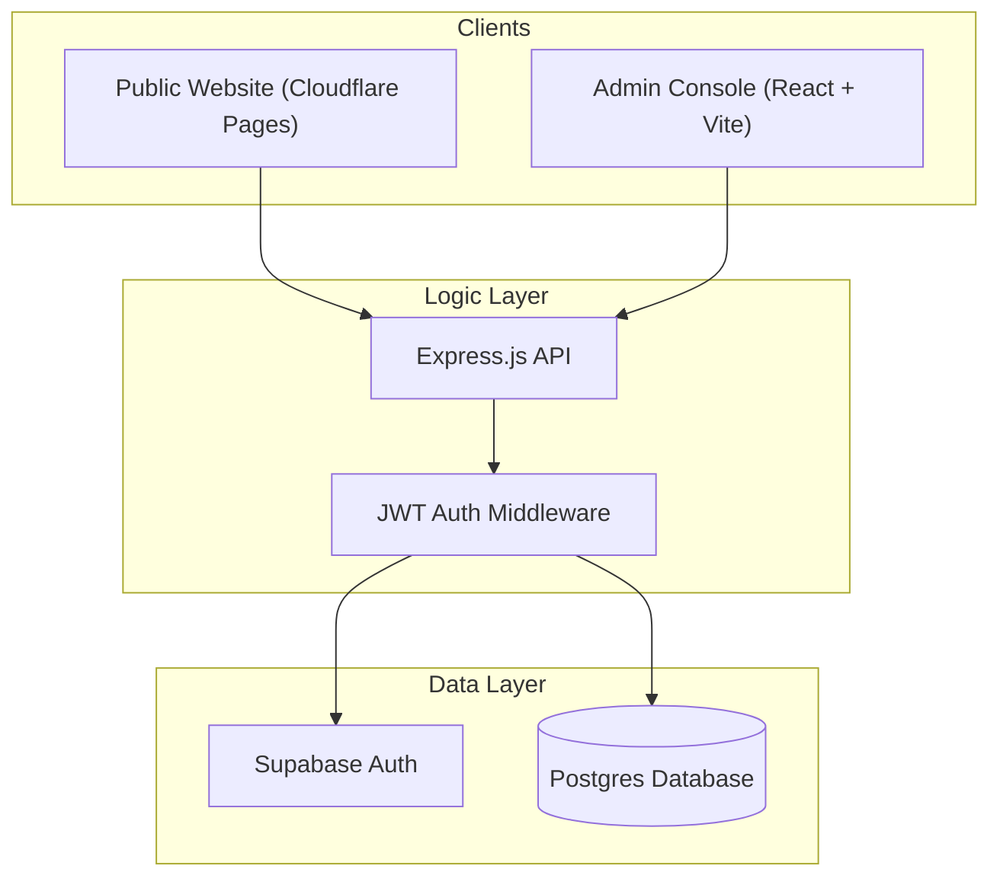

# System Architecture

The BrAIN Labs Inc. official platform is built as a modern, decoupled web application comprising a specialized admin console and a researcher ecosystem.

## 🏗️ High-Level Overview

The system follows a standard **Client-Server** architecture with a centralized **PostgreSQL** database managed via **Supabase**.

## 👥 Member Role Model (ISA)

The core of the system's identity management is based on the **ISA (Is-A)** specialization pattern. Every user is a `member`, but they specialize into specific roles.

### Role Hierarchy & Approval Workflow

| Role | Approval Required? | Description |
| :--- | :--- | :--- |
| **Admin** | **No** | Implicitly approved. Has full access to moderation and user management. |
| **Researcher** | **Yes** | Requires admin approval after registration to access the workspace. |
| **Research Assistant** | **Yes** | Assigned by a Researcher; requires admin approval for system access. |

### Logic: Why Admins are Exempt
Admins are the guardians of the system. In `schema(2).sql`, only the `researcher` and `research_assistant` tables include an `approval_status` column. Admins are created through a secure seeding process or by other admins, and are therefore considered **implicitly approved**.

## 🔐 Security Layers

1.  **Supabase Auth**: Handles initial credential verification (Email/Password).
2.  **Express JWT**: Upon successful Supabase login, the backend issues a custom JWT containing the user's specific **ISA Role** and **Member ID**.
3.  **Role Gating**: Backend routes are protected by middleware that verifies the JWT and ensures the user has the required role (e.g., `admin`) to access certain endpoints.

## 🛠️ Technology Stack

-   **Frontend**: React 18, Vite, Tailwind CSS, Axios, Lucide Icons.
-   **Backend**: Node.js, Express.js, Supabase JS SDK.
-   **Database**: PostgreSQL (Supabase).
-   **Hosting**: Cloudflare Pages (Frontend), Generic Node.js Host (Backend).
