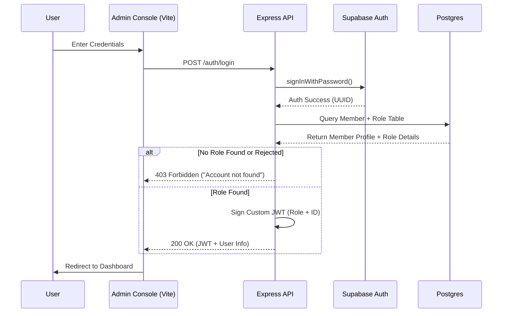

# Authentication & Authorization Flow

The BrAIN Labs Inc. platform uses a robust, two-tier authentication system that leverages **Supabase Auth** for identity and a **custom JWT framework** for role-based authorization.

## 🔐 Registration Flow

1.  **Submission**: User provides registration details (Email, Password, Name, Role).
2.  **Supabase Create**: The backend calls `supabase.auth.admin.createUser()` to secure the credentials.
3.  **Member Assignment**: A new row is added to the `member` table, linked to the Supabase UUID.
4.  **Role Specialization**: A corresponding entry is created in the `researcher` or `research_assistant` specialization tables.
5.  **Pending State**: The user is initialized with an `approval_status = 'PENDING'`.

## 🔓 Login & Authorization Sequence



## 🛡️ Role-Based Access Control (RBAC)

Once logged in, the **Express JWT Middleware** (`authenticateToken`) intercepts every protected API call.

### Logic: Admin Exemption
-   **Middleware Verification**: The JWT is decoded to retrieve the user's `role` and `id`.
-   **Admin Privilege**: If `role === 'admin'`, the request is authorized immediately for administrative endpoints.
-   **Researcher/RA Check**: If the role is `researcher` or `research_assistant`, the backend verifies that their `approval_status` is **`APPROVED`**.
-   **Rejection**: Users with a **`PENDING`** or **`REJECTED`** status can only access the `/me` and `/auth` endpoints.

## 🔑 JWT Structure

A typical payload signed by the Express backend:

```json
{
  "sub": 12,                    // Member ID
  "role": "researcher",         // ISA Role (admin, researcher, etc.)
  "email": "user@example.com",  // Contact Email
  "slug": "research-user-12",   // Profile Slug
  "iat": 1711982400,
  "exp": 1714574400
}
```

---

> [!IMPORTANT]
> The JWT secret key MUST be securely stored in the backend `.env` as `JWT_SECRET`. The frontend NEVER sees this secret and only manages the signed token.
