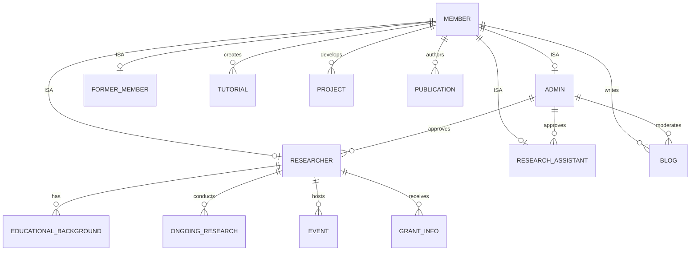

# Database Schema

The BrAIN Labs Inc. platform uses a specialized **PostgreSQL** schema managed via **Supabase**, designed with an **ISA (Is-A)** specialization hierarchy for members.

## 📊 Entity Relationship Diagram

The following Mermaid diagram illustrates the specialization model and key content relations.

## 📋 Core Entity Tables

### 👤 Member (Base Table)
`member`
The primary identity table for all users.
- `id`: Unique serial ID.
- `auth_user_id`: UUID link to Supabase Auth.
- `slug`: Personalized URL identifier.

### 🛡️ Admin (Specialization)
`admin`
No `approval_status` — admins are implicitly authorized. Linked to `member` via `member_id`.

### 🔬 Researcher (Specialization)
`researcher`
Includes professional details and an **`approval_status`** (`PENDING`, `APPROVED`, `REJECTED`).
- `country`, `linkedin_url`, `bio`, `occupation`, `workplace`.
- `approved_by_admin_id`: FK to the admin who performed the review.

### 🧪 Research Assistant (Specialization)
`research_assistant`
Similar to Researcher but assigned to a specific **Researcher** via `assigned_by_researcher_id`.
- `approval_status`: Managed by admins.

## 📚 Content Entities

The platform manages various research-related content, all of which require **Admin Moderation** before appearing on the public website.

- **Blog**: Rich articles with keywords and images.
- **Tutorial**: Practical guides created by members.
- **Project**: Research initiatives with architecture diagrams.
- **Publication**: Academic works (Conference papers, Books, Journals, Articles).
- **Event**: Hosted research events (Date, Time, Premises).
- **Grant Info**: Funding and sponsorship details.

## ⚙️ Automated Triggers

- **`set_updated_at`**: Automates the `updated_at` timestamp across all content tables whenever a row is modified.

---

> [!NOTE]
> All schema details are derived from the canonical `schema(2).sql` file. Any modifications to the database should be reflected in that file and this document.
